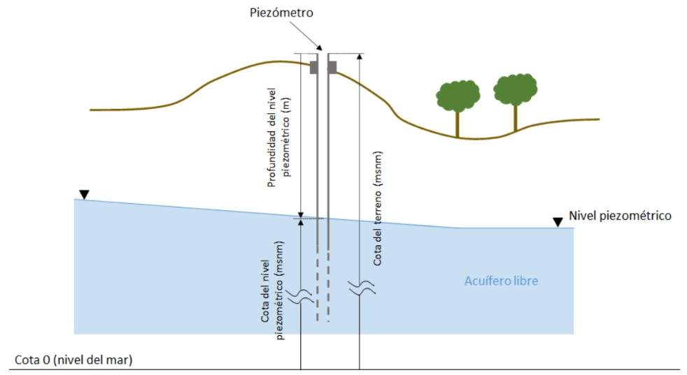

## Piezómetros de Almería

```{r cargar_archivo, include=F}
library(tidyverse)
library(ggplot2)
library(readr)
piezometros <- read_csv2("lista_piezometros_almeria_20260220.csv", locale = locale(encoding = "Latin1"))
```

En Almería hay un total de **`r nrow(piezometros)-1` piezómetros**. Estos piezómetros son gestionados actualmente por el *Ministerio de Transición Ecológica y Reto Demográfico* (MITECO, <https://sig.mapama.gob.es/redes-seguimiento/index.html?herramienta=Piezometros>). El MITECO tomó el relevo del *Instituto Geológico y Minero de España* (IGME, <https://info.igme.es/bdaguas/>).


## Masas de agua subterráneas de la provincia de Almería

Dentro de la provincia de Almería existen varias masas de agua subterráneas. Por extensión, la mayor es la de *Campo de Dalías-Sierra Gádor*, muy vulnerable a la intrusión marina [@pulido_bosch_recursos_1997]. 

Este es el listado de todas las masas de agua subterráneas de la provincia que están monitoreadas por los piezómetros de la red de seguimiento del MITECO.

```{r grafico, echo=F}
piezometros_MASb <- piezometros |> 
  count(MASb_controlada)

ggplot(piezometros_MASb, aes(x = MASb_controlada, y = n)) +
  geom_bar(stat = "identity") +
  labs(
    x = "Masa de agua subterránea",
    y = "Número de piezómetros",
    title = "Número de piezómetros por masa de agua subterránea"
  ) +
  theme_minimal() +
  theme(axis.text.x = element_text(angle = 45, hjust = 1))
```

```{r tabla, echo=F}
knitr::kable(piezometros_MASb, 
             col.names = c("Masa de agua subterránea", "Número de piezómetros"))
```




## Problemática de los acuíferos

Dentro de la provincia de Almería hay gran extensión de invernaderos. En ella se genera el 60% de la producción hortícola de Andalucía. Y la fuente principal de agua en la provincia proviene de las masas de agua subterráneas, debido a la escasez de lluvia y a la imposibilidad de depender de ríos y embalses [@cerrillo_lopez_acuiferos_2009]. 

Toda explotación de un acuífero conlleva cambios en el flujo natural de las aguas subterráneas. El principal efecto es la disminución del nivel freático, junto con el agotamiento de las reservas. Cualquier explotación de un acuífero, incluso si no es intensiva, produce una reducción de las reservas de agua y del caudal de salida del acuífero [@custodio_sustainability_2019].


```{r mapa, echo=F}
library(leaflet)
leaflet() |> 
  addTiles() |>   # mapa base (OpenStreetMap)
  setView(lng = -2.463, lat = 37.048, zoom = 8) %>%
  addMarkers(
    lng = -2.463,
    lat = 37.048,
    popup = "Provincia de Almería"
  )
```


## Bibliografía

